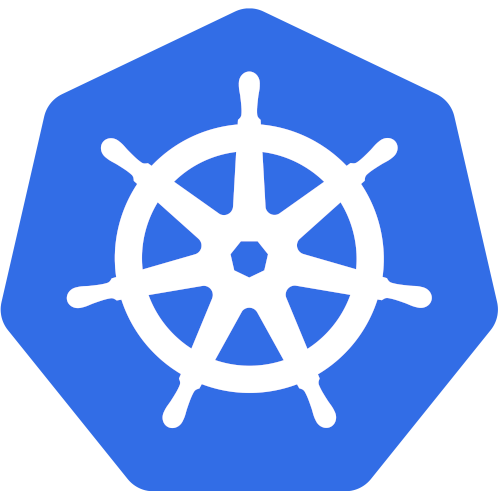
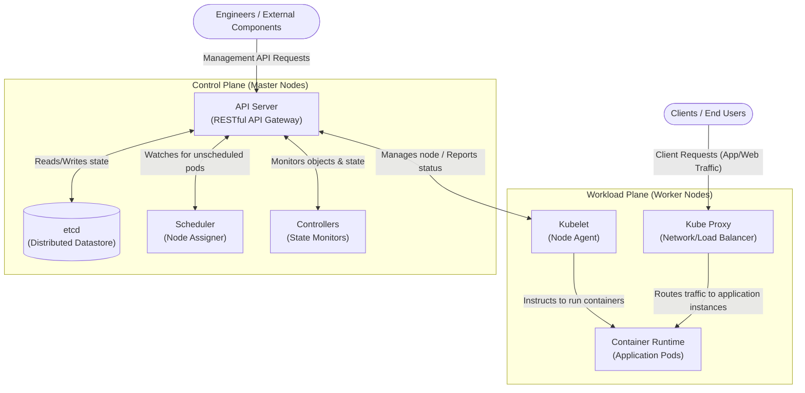
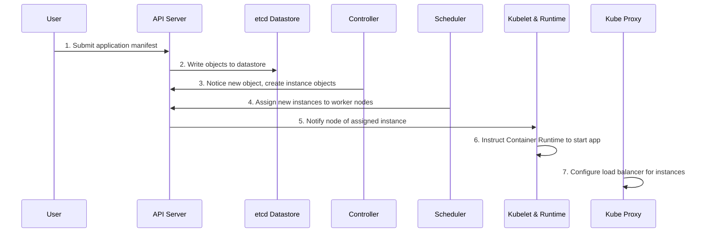
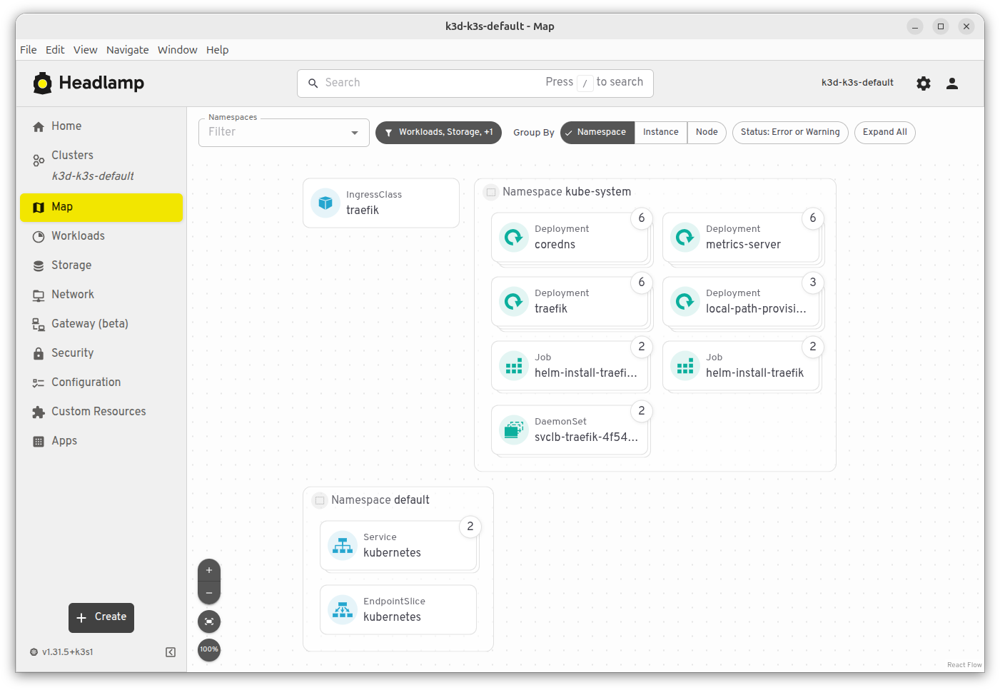

# Fundamentals and K3D

## Introducing Kubernetes

Kubernetes (Greek for helmsman) is a software system for automating the deployment and management of complex, large-scale application systems composed of computer processes running in containers. While you act as the captain deciding the system's overall direction, Kubernetes acts as the helmsman that steers the applications and reports on their operational status.


### Core Benefits of Kubernetes

1. **Infrastructure Abstraction** – Kubernetes hides the details of the underlying hardware, networks, and computers from the users and applications.
2. **Declarative Deployment** – Users describe the desired state of an application via a single manifest, and Kubernetes automatically takes the necessary steps to turn that description into a running application.
3. **Automated Management** – The system assumes daily management tasks, such as automatically restarting failed applications or moving them to healthy nodes in the event of hardware failures.
4. **Improved Hardware Utilization** – By dynamically deciding where to place each application based on available resources, Kubernetes tightly packs applications together to run more workloads on fewer servers.
5. **Portability** – Because applications interact with standardized Kubernetes APIs rather than proprietary cloud provider APIs, systems can be easily moved between local data centers and various cloud providers.

### The Kubernetes Architecture

A Kubernetes cluster is fundamentally divided into two groups of machines: the **Control Plane** (hosted on master nodes) and the **Workload Plane** (hosted on worker nodes).


#### Control Plane Components (Master Nodes)

The Control Plane serves as the brain of the system, holding and controlling the state of the cluster without running the actual applications.

| Component         | Function                                                                                              |
|-------------------|-------------------------------------------------------------------------------------------------------|
| **API Server**    | Exposes the RESTful Kubernetes API used by engineers and components to create and manage objects.     |
| **etcd**          | A distributed datastore that persists all the objects created via the API Server.                     |
| **Scheduler**     | Decides which specific worker node should run each newly created application instance.                |
| **Controllers**   | Monitor the API for new objects and perform the necessary operations to bring those objects to life.  |

#### Workload Plane Components (Worker Nodes)

The Workload Plane consists of the worker nodes where your actual applications (workloads) are executed.

| Component             | Function                                                                                                             |
|-----------------------|----------------------------------------------------------------------------------------------------------------------|
| **Kubelet**           | An agent that communicates with the API server, manages local applications, and reports node and application status. |
| **Container Runtime** | Software (such as Docker) that physically runs the application containers as instructed by the Kubelet.              |
| **Kube Proxy**        | Sets up load balancers and routes network traffic between different application instances.                           |

### Application Deployment Flow

When you deploy an application, a sequence of automated events occurs across the cluster components.



### Deployment Environments

Organizations must decide where to physically host their Kubernetes clusters, each offering different operational characteristics.

1. **On-Premises** – Runs directly on your organization's bare-metal machines or virtual machines. This is often required by strict regulations but is harder to scale horizontally on short notice.
2. **Cloud** – Runs on a cloud provider's infrastructure. This offers high elasticity, allowing Kubernetes to provision or destroy virtual machines on demand to optimize resources and costs.
3. **Hybrid Cloud** – Runs locally but is configured to "spill over" into the cloud during temporary periods of peak load.

### Challenges and Considerations

While powerful, Kubernetes is not the right choice for every organization or application architecture.

1. **High Complexity** – Managing a production-ready cluster requires intimate knowledge of its inner workings. Inexperienced teams are strongly advised to use managed Kubernetes-as-a-Service offerings (like GKE, EKS, or AKS) rather than deploying it themselves.
2. **Not for Monoliths** – If an application is a large, tightly-coupled monolith, Kubernetes provides no architectural benefits.
3. **Overkill for Small Systems** – Systems containing fewer than five microservices may find the added complexity and resource overhead of Kubernetes outweighs its automation benefits.
4. **Initial Cost Investment** – Introducing Kubernetes requires upfront investments in engineering time for training, building new tools, and procuring additional computing resources for the cluster overhead itself.

> ❓ **When to use Kubernetes?**  
> Kubernetes excels in high complexity scenarios like a geographically distributed hybrid cloud.  
> Consider using **simpler solutions** in less complex scenarios (like Docker Swarm for a small on-premise private cloud or 
> Slurm for batch HPC applications).

## `kubectl`
`kubectl` (often pronounced `kube-control` or `kube-cuddle`) is the primary CLI tool for managing a Kubernetes cluster.
You can install it by running the following command:
```shell
# GNU/Linux
curl -LO "https://dl.k8s.io/release/$(curl -L -s https://dl.k8s.io/release/stable.txt)/bin/linux/amd64/kubectl"

# macOS
curl -LO "https://dl.k8s.io/release/$(curl -L -s https://dl.k8s.io/release/stable.txt)/bin/darwin/arm64/kubectl"
```
`kubectl` features native autocompletion, which saves a lot of typing. To configure it, follow the official guides for [Linux](https://kubernetes.io/docs/tasks/tools/install-kubectl-linux/#enable-shell-autocompletion) or [macOS](https://kubernetes.io/docs/tasks/tools/install-kubectl-macos/#enable-shell-autocompletion).

### How `kubectl` works
`kubectl` is a user-friendly wrapper for the Kubernetes API server. Under the hood, it is simply a REST client that sends HTTP requests to the cluster's Control Plane.
It communicates with the API server specified in the YAML configuration file located at `~/.kube/config`, or at the path specified by your `KUBECONFIG` environment variable. 
Usually, you don't have to write this file manually; tools like `k3d`, `minikube`, and cloud CLIs (like gcloud) will generate and modify it automatically.

## How to install Kubernetes without having a cluster?
You don't need a full-fledged cloud environment or dedicated servers to learn Kubernetes. Several software tools allow you to run test clusters directly on your local machine:

| Tool                                  | Description                                                                                                       | Pros                                                                                   | Cons                                                                                                                             |
|---------------------------------------|:------------------------------------------------------------------------------------------------------------------|:---------------------------------------------------------------------------------------|:---------------------------------------------------------------------------------------------------------------------------------|
| **Docker Desktop**                    | A built-in feature of the Docker Desktop GUI that spins up a single-node cluster.                                 | Simple one-click setup via GUI; easy installation on Windows/macOS.                    | Very heavy on system resources; only supports single-node clusters.                                                              |
| **kind** <br>*(Kubernetes in Docker)* | A CLI tool that runs standard Kubernetes by spinning up Docker containers to act as the "nodes".                  | Supports multi-node clusters; runs the full, standard version of Kubernetes.           | Network traffic inspection between nodes (e.g., using Wireshark) can be difficult.                                               |
| **Minikube**                          | A mature CLI tool that runs a cluster inside a separate VM or using containers.                                   | Great out-of-the-box experience; highly supported with many built-in addons.           | Can be slower and resource-heavy if using the VM driver.                                                                         |
| **k3d**                               | A CLI wrapper that runs `k3s` (a highly efficient, lightweight Kubernetes distribution by Rancher) inside Docker. | Extremely lightweight (low CPU/RAM usage); fast startup; supports multi-node clusters. | Uses `k3s` instead of standard k8s, which is perfectly fine for 99% of use cases but strips out some legacy/enterprise features. |

We will use `k3d` because of its features.

To install `k3d` run the following command:
```shell
# GNU/Linux
curl -s https://raw.githubusercontent.com/k3d-io/k3d/main/install.sh | bash

# macOS
brew install k3d
```
On `bash` and `zsh`, `k3d` features native autocompletion.  
Follow this guide to configure it: [k3d autocompletion](https://k3d.io/v5.1.0/usage/commands/k3d_completion/).

## Start a simple cluster
To start a cluster with `k3d` run the following command.

```shell
k3d cluster create CLUSTER_NAME -s 1 -a 3
```
Here's a breakdown of this command:
- `cluster create CLUSTER_NAME`: creates a cluster with specified name (default name is `k3s-default`)
- `-s N`: *server*, number of nodes in control plane
- `-a N`: *agent* number of worker nodes

To list the clusters on your device:
```shell
k3d cluster list
```

To stop/start an existing cluster:
```shell
k3d cluster stop
k3d cluster start
```

To remove a cluster and its files:
```shell
k3d cluster delete CLUSTER_NAME
```

You can verify that your cluster has successfully started by running
```shell
kubectl cluster-info
```

## Headlamp
Sometimes, it can be useful to check the cluster status from a GUI.  
[Headlamp](https://headlamp.dev/) is a dashboard for Kubernetes which allows you to see the status of the cluster and 
run some routine commands easily instead of using `kubectl` command line. You can refer to headlamp website for download and 
install.


## Docker
Before we start make sure you have Docker installed, a Docker Hub account and that you have run `docker login`.
Indeed, you will need to create containers and upload them on a registry to make them usable from Kubernetes' nodes.

Brief guide if you have never done this.

When building an image, make sure to tag it:
```shell
docker build . -t DOCKER_HUB_USERNAME/IMAGE_NAME:version
```

Once you have built an image, you can push it to the registry with
```shell
docker push DOCKER_HUB_USERNAME/IMAGE_NAME:version 
```
