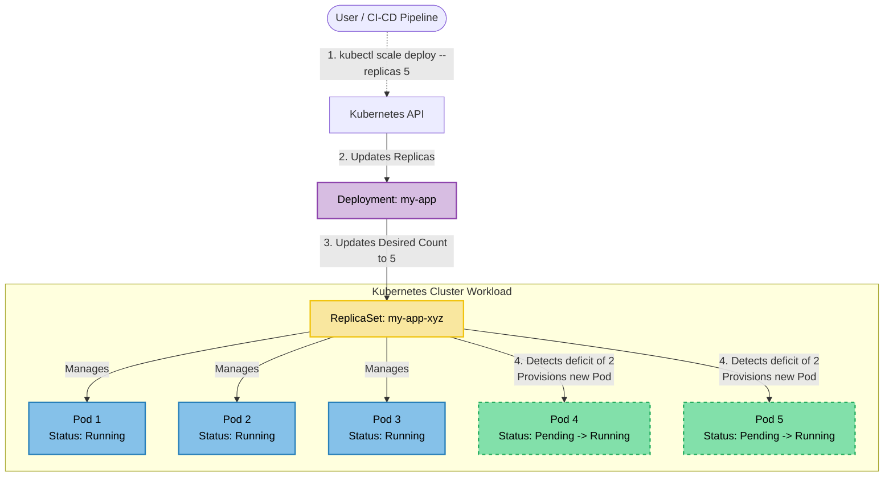
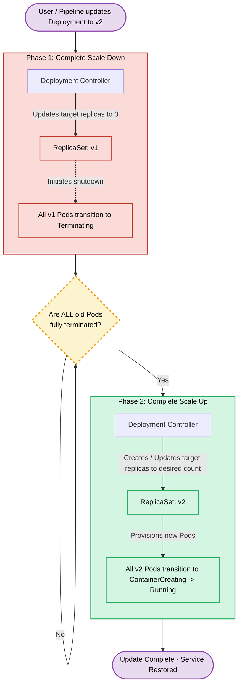
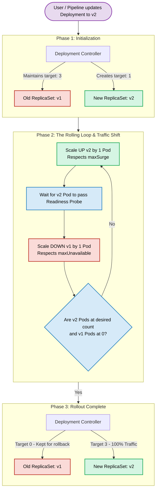

# 4 - Managing Pods with deployments
A **Deployment** is a Kubernetes API object that allows you to declare the desired state of your application, delegating the 
complex mechanics of getting to that state to Kubernetes itself.  
While you can run applications by creating individual Pods, managing them manually during updates or node failures is 
impractical. Deployments solve this by providing declarative updates, horizontal scaling, and self-healing mechanisms.  
Rather than manually replacing old Pods with new ones, you simply update the Deployment configuration, and the Kubernetes 
Deployment controller automates the transition at a controlled rate. Because Deployments treat individual Pods as fungible 
(easily replaceable) replicas, they are the standard choice for running stateless workloads.

Here is a minimal YAML declaration of a Deployment:
```yaml
apiVersion: apps/v1
kind: Deployment
metadata:
  name: nginx-deployment
spec:
  replicas: 3
  selector:
    matchLabels:
      app: web
  template:
    metadata:
      labels:
        app: web
    spec:
      containers:
      - name: nginx
        image: nginx:1.21
```

## Understanding Deployment `spec`
| Field      | Description                                                                                                                                      |
|------------|--------------------------------------------------------------------------------------------------------------------------------------------------|
| `replicas` | The desired number of identical Pods to run concurrently. Kubernetes actively maintains this exact count.                                        |
| `selector` | A label query that tells the Deployment which Pods belong to it. This must match the labels defined in the `template`.                           |
| `template` | The blueprint (Pod Template) used to stamp out new Pods. It contains its own metadata (labels) and specifications (containers, images, volumes). |
| `strategy` | Defines the exact methodology Kubernetes will use to replace old Pods with new ones when the Pod template is updated.                            |

## 1. Deployment scaling
Scaling a Deployment up or down is as simple as modifying the `replicas` field in the YAML manifest or executing a command 
like `kubectl scale deployment <name> --replicas 5`.

To understand how this works under the hood, it is essential to understand **ReplicaSets**.
A ReplicaSet is a lower-level Kubernetes object whose sole responsibility is to ensure that a specified number of Pod 
replicas are running at any given time.

Deployments do not manage Pods directly. Instead, a **Deployment manages a ReplicaSet**, and that ReplicaSet directly 
creates and manages the Pods. When you scale a Deployment, the Deployment controller simply updates the desired replica 
count on the underlying ReplicaSet. The ReplicaSet controller then provisions or terminates Pods to match that new target.

Deployments can be **autoscaled** by using the following object: `HorizontalPodAutoscaler` (HPA). With HPA, you can define 
a controller which scales up or down your application *automagically* when a specified metric (e.g. response time) differs
from its desired value.  
Since this object is really complex to manage and define and its usage differs completely from application to application,
it is not explained in this guide.  
You can find more information about it at [Kubernetes documentation - HPA](https://kubernetes.io/docs/concepts/workloads/autoscaling/horizontal-pod-autoscale/).

**Example**:
```shell
kubectl scale deployment product-service --replicas 5
```



## 2. Deployment update strategy
The true power of a Deployment lies in its ability to update workloads seamlessly. When you change the Pod template 
(for instance, updating the container image to a new version), a rollout is triggered. Kubernetes currently supports two 
main native update strategies:
- `Recreate`: destroy all current active pods and start the new version
- `RollingUpdate`: gradually stop pods and start the updated version

### 2.1 Recreate strategy
With the Recreate strategy, the Deployment controller scales the existing ReplicaSet down to zero, destroying all currently 
running Pods simultaneously. Only after the old Pods are completely terminated does it create a new ReplicaSet and spin 
up the new Pods.
- **Pros**: Prevents version collisions. The old and new versions of the application never run at the same time.
- **Cons**: Causes complete service downtime while the replacement Pods are provisioning.

**YAML declaration**
```yaml
apiVersion: apps/v1
kind: Deployment
metadata:
  name: my-app-recreate
spec:
  replicas: 3
  strategy: # The update strategy is defined here
    type: Recreate
  selector:
    matchLabels:
      app: my-web-app
  template:
    metadata:
      labels:
        app: my-web-app
    spec:
      containers:
      - name: web-container
        image: my-app:v2
```



### 2.2 RollingUpdate strategy
The RollingUpdate strategy (which is the default) guarantees zero downtime. It gradually removes old Pods while 
simultaneously starting new ones. During this process, client traffic is distributed across both the old and new 
versions of the application. The speed and safety of this rollout are controlled by two parameters:
- **maxSurge**: The maximum number of Pods that can be created above the desired replica count during the update.
- **maxUnavailable**: The maximum number of Pods that can be unavailable during the update process.

**YAML declaration**:
```yaml
apiVersion: apps/v1
kind: Deployment
metadata:
  name: my-app-rolling
spec:
  replicas: 4
  strategy:
    type: RollingUpdate # Define the update strategy here
    rollingUpdate:
      # How many extra Pods can be created above the desired replica count
      maxSurge: 1 
      # How many Pods can be missing from the desired replica count
      maxUnavailable: 25% 
  selector:
    matchLabels:
      app: my-web-app
  template:
    metadata:
      labels:
        app: my-web-app
    spec:
      containers:
      - name: web-container
        image: my-app:v2
```



### 2.3 Advanced update strategies
While Recreate and RollingUpdate are built into the Deployment object, the flexibility of Kubernetes allows you to 
construct more advanced rollout patterns using a combination of multiple Deployments, Services, and Ingress controllers:

| Strategy        | Concept                                                                                                                                                      |
|-----------------|--------------------------------------------------------------------------------------------------------------------------------------------------------------|
| **Canary**      | Releasing a new version to a very small subset of users to validate stability before a full rollout.                                                         |
| **A/B testing** | Routing specific user segments to a new version based on conditions like location or headers to measure performance/engagement.                              |
| **Blue/Green**  | Deploying the entire new version alongside the old one, then instantly flipping a network switch (Service selector) to route all traffic to the new version. |
| **Shadowing**   | Mirroring live production traffic to a hidden new version to test how it handles real-world loads without impacting end users.                               |

## Update rollbacks
Deployments act as a safety net. If you deploy a faulty version of an application (e.g., a version that crashes on 
startup or fails its readiness probes), the Deployment controller will halt the `RollingUpdate` process, preventing a 
complete cluster outage.

Kubernetes preserves a history of previous ReplicaSets. This allows you to quickly revert to a known, stable state using 
the rollback command:

```shell
kubectl rollout undo deployment DEPLOYMENT-NAME
```

This command immediately tells the Deployment to scale the new, faulty ReplicaSet back down to zero and scale the previous, 
stable ReplicaSet back up to the desired target, restoring service reliability.