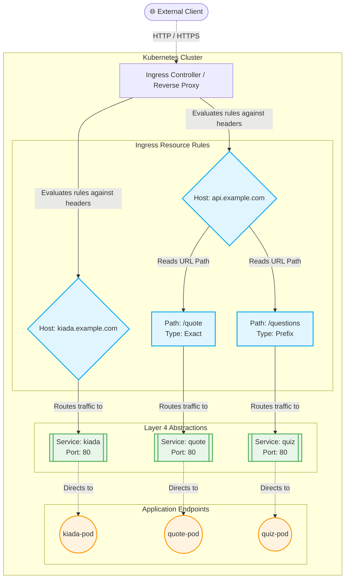

# 6 - Ingress
In Kubernetes, an Ingress is an API object that provides a way for external clients to access the services of applications 
running inside your cluster. It operates at Layer 7 (the Application Layer) of the OSI model.

The Ingress ecosystem relies on three main components:
- The Ingress API Object: The YAML file defining your routing rules.
- The Reverse Proxy (L7 Load Balancer): The component that physically handles incoming HTTP traffic and routes it to backend pods.
- The Ingress Controller: The software that monitors the Kubernetes API for new Ingress objects and provisions/configures the reverse proxy accordingly.

> ❓ **Why is Ingress useful?**
> - **IP Conservation**: You only need a single public IP address to expose multiple services. 
> - **Advanced L7 Features**: It provides capabilities that standard Layer 4 services cannot, such as HTTP authentication, cookie-based session affinity, URL rewriting, and TLS termination. 
> - **Direct-to-Pod Routing**: Most ingress implementations bypass the Service IP entirely, routing external traffic directly to the target pods.

**YAML declaration**:
```yaml
apiVersion: networking.k8s.io/v1
kind: Ingress
metadata:
  name: ingress-example-com
spec:
  rules:
  - host: ingress.example.com
    http:
      paths:
      - path: /
        pathType: Prefix
        backend:
          service:
            name: ingress
            port:
              number: 80
```



## Getting the Public IP and Local DNS Setup
Once you apply your Ingress YAML, the controller will provision the proxy. You need the proxy's public IP address to 
route traffic.

**Retrieve the Ingress IP**:
```shell
kubectl get ingresses
```
Look under the ADDRESS column to find your allocated IP (e.g., **11.22.33.44**). Note that in cloud environments, it may take a few minutes for this address to populate.

**Configure Local DNS**:
Ingresses rely on virtual hosting. Sending a generic HTTP request to 11.22.33.44 will fail because the proxy uses the 
HTTP Host header to determine where to route the traffic. For local testing without a real DNS server, you have two options:
- **Option A** (Modify `/etc/hosts`): Add a mapping directly to your machine's host file.
```
11.22.33.44    ingress.example.com
```
- **Option B** (Use `curl` overrides): Use `curl`'s resolve flag to manually map the host to the IP.
```shell
curl --resolve ingress.example.com:80:11.22.33.44 http://ingress.example.com
```

## 1. Path-Based Traffic Routing
An Ingress object is not limited to a single backend. You can expose entirely different services under the exact same 
hostname by routing traffic based on the URL path.
For example, you might want api.example.com/quote to route to a quote service, and `api.example.com/questions` to route 
to a quiz service. You simply add multiple entries to the paths array under your host rule in the YAML declaration.

**Path matching types**

| Exact                      | Description                                   | Matching Behavior                                              |
|----------------------------|-----------------------------------------------|----------------------------------------------------------------|
| **Exact**                  | Case-sensitive, precise URL string match.     | `/foo` matches exactly `/foo` (but not `/foo/bar` or `/foo/`). |
| **Prefix**                 | Element-by-element prefix match split by `/`. | `/foo` matches `/foo/bar` and `/foo/` (but not `/foobar`).     |
| **ImplementationSpecific** | Defined by the specific ingress controller.   | e.g., GKE allows wildcard usage like `/foo/*`.                 |

Public IP addresses cost money. Instead of creating a new Ingress object (and provisioning a new IP) for every hostname, 
you can define multiple rules within a single Ingress object.
```yaml
spec:
  rules:
  - host: ingress.example.com
    http:
      paths:
      # Paths for ingress go here
      - path: /quote
        pathType: Exact
        backend:
          service:
            name: quote-service
            port:
              number: 80
      # ...
  - host: api.example.com
    http:
      paths:
      # Paths for api services go here
      - path: /backend
        pathType: Prefix
        backend:
          service:
            name: backend-service
            port:
              number: 80
      # ...
```

## 2. Setting up TLS for Ingress
To secure external traffic, we configure the Ingress proxy to handle TLS termination. The proxy intercepts the encrypted 
HTTPS traffic, decrypts it, and forwards plain HTTP to the backend pods.
**Step 1: Create a TLS Secret**
The proxy requires a certificate and private key. We store these securely in a Kubernetes `Secret`.
```shell
kubectl create secret tls tls-example-com --cert=example.crt --key=example.key
```

**Step 2: Attach Secret to Ingress**
We update our Ingress YAML by adding a `tls` block to the `spec` section. The `hosts` listed under tls must match the 
names on your certificate.
```yaml
spec:
  tls:
  - secretName: tls-example-com
    hosts:
    - "*.example.com"
  rules:
  # ... existing rules ...
```

## 3. Configuring Ingress Using Annotations
The standard Ingress spec intentionally lacks fields for advanced proxy configurations (like CORS, URL rewriting, or 
session affinity). This is because different ingress controllers (Nginx, Traefik, HAProxy) support completely different 
features.  
To utilize these controller-specific features, we use Annotations in the metadata block.

**Example: Enabling Cookie-Based Session Affinity in Nginx**  
Standard Kubernetes Layer 4 services only support client-IP session affinity. Because Ingress operates at Layer 7, we 
can configure cookie-based affinity using annotations specific to the Nginx controller.
```yaml
apiVersion: networking.k8s.io/v1
kind: Ingress
metadata:
  name: ingress
  annotations:
    nginx.ingress.kubernetes.io/affinity: cookie
    nginx.ingress.kubernetes.io/session-cookie-name: SESSION_COOKIE
spec:
  # ... rules ...
```

When a client connects, the proxy injects a cookie. Subsequent requests carrying that cookie are guaranteed to route to 
the exact same backend pod. Always consult your specific ingress controller's documentation to see which annotations are 
supported.
