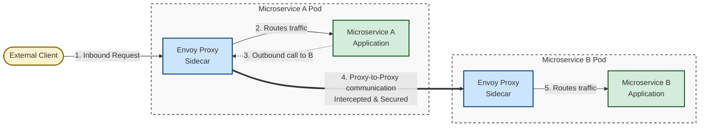
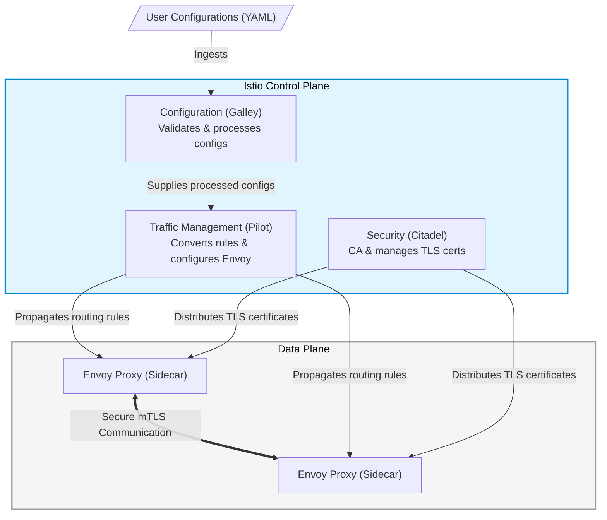

# 8 - Istio

**Istio** is an open-source, independent service mesh that provides the fundamental capabilities needed to run a distributed 
microservice architecture successfully. It acts as a dedicated infrastructure layer sitting on top of your applications, 
controlling how different parts of an application share data with one another.  

> ❓ **Why is it useful?**  
> The primary advantage of Istio is that it delivers **critical operational capabilities** without requiring any **changes to 
> your application code**. Instead of developers manually programming libraries for routing, encryption, or logging into 
> every single microservice, Istio handles these concerns transparently at the platform layer.

**Key capabilities**:
- **Traffic Management**: Allows you to set up dynamic routing policies, load balancing, and traffic splitting (e.g., for 
  canary deployments or A/B testing) based on various HTTP/TCP criteria.
- **Security**: Secures service-to-service communication by providing identity verification, strong access controls, 
  authorization policies, and automated encryption.
- **Observability**: Generates detailed telemetry, distributed tracing, and logging for all traffic within the mesh, 
  allowing you to visualize your architecture through tools like Prometheus and Grafana.

## Istio architecture
Istio’s architecture is split into two primary layers: the **Data Plane** and the **Control Plane**.

### 1. The Data Plane
The data plane consists of a network of intelligent proxies based on the open-source Envoy proxy.
- Instead of exposing your microservice pods directly to the network, an Envoy proxy is deployed alongside your 
  application inside the same pod as a sidecar container.
- The sidecar sits on the frontline: it intercepts all inbound and outbound network traffic for the microservice, 
  executing policies without the application realizing it.



### 2. The Control Plane
The control plane manages and configures the proxies in the data plane to route traffic and enforce policies. It consists of several core components:
- **Traffic Management (formerly Pilot)**: Converts high-level routing rules into Envoy-specific configurations and propagates them to the sidecars.
- **Security (formerly Citadel)**: Acts as a Certificate Authority (CA), generating and managing TLS certificates to enable secure mutual TLS (mTLS) communication between microservices.
- **Configuration (formerly Galley)**: Validates, processes, and ingests user-provided configurations (like YAML files) into the Istio system.



## `istioctl` definition and setup
`istioctl` is the dedicated command-line configuration utility for Istio. It allows operators to debug the service mesh, 
verify installation status, and interact directly with the control plane.

**Step-by-Step Installation:**
- **Download the Release**: Run the official script to download the binary files and sample configurations (such as the bookinfo application) directly into your workspace:

```shell
curl -L https://istio.io/downloadIstio | sh -
```

- **Navigate to the Directory**: Move into the newly created folder (the version may vary based on the latest stable release downloaded):
```shell
cd istio-*
```

- **Add the Binary location to Your Path**: To make `istioctl` globally accessible in your terminal, move it to your local binary folder:
```shell
export PATH=$PWD/bin:$PATH
```

- **Verify the Host Installation**: Confirm the utility is active and ready:
```shell
istioctl --help
```

## Installing Istio on k3d
Follow the guide at [Istio k3d setup](https://istio.io/latest/docs/setup/platform-setup/k3d/).  

### Prerequisite: Install Helm
To install `helm` follow the guide on [`helm` website](https://helm.sh/docs/intro/install/).

On Ubuntu:
```shell
HELM_BUILDKITE_APT_KEY_ID="DDF78C3E6EBB2D2CC223C95C62BA89D07698DBC6"

sudo apt-get install curl gpg apt-transport-https --yes

curl -fsSL https://packages.buildkite.com/helm-linux/helm-debian/gpgkey > "${TMPDIR:-/tmp}/helm.gpg"

# Ensure that the key ID matches to prevent a repository compromise from establishing an attacker controlled key
if [ "$(gpg --show-keys --with-colons "${TMPDIR:-/tmp}/helm.gpg" | awk -F: '$1 == "fpr" {print $10}' | head -n 1)" != "${HELM_BUILDKITE_APT_KEY_ID}" ]; then echo "ERROR: Unexpected Helm APT key ID: potential key compromise"; exit 1; fi

cat "${TMPDIR:-/tmp}/helm.gpg" | gpg --dearmor | sudo tee /usr/share/keyrings/helm.gpg > /dev/null
echo "deb [signed-by=/usr/share/keyrings/helm.gpg] https://packages.buildkite.com/helm-linux/helm-debian/any/ any main" | sudo tee /etc/apt/sources.list.d/helm-stable-debian.list

sudo apt-get update
sudo apt-get install helm
```

### Istio installation
1. Create cluster with the following command
```shell
k3d cluster create --api-port 6550 --agents 2 --k3s-arg '--disable=traefik@server:*' istio-cluster
```

2. Install `istio` with `k3d`
```shell
helm install istio-base istio/base -n istio-system --set defaultRevision=default --wait --create-namespace
```

3. Install **Istio Discovery**
```shell
helm install istiod istio/istiod -n istio-system --wait
```

4. Verify installation of `istiod`
```shell
helm status istiod -n istio-system
```

5. Enable automatic sidecar injection
```shell
kubectl label namespace default istio-injection=enabled
```

6. Determine the Docker Network Subnet
```shell
docker network inspect k3d-istio-cluster | grep Subnet
```

7. Install `MetalLB` with Helm (see [MetalLB website](https://metallb.io/installation/)):
```shell
helm repo add metallb https://metallb.github.io/metallb
helm repo update
helm install metallb metallb/metallb -n metallb-system --wait --create-namespace
```

> ❓ **Why installing MetalLB?**  
> "Vanilla" `k3d` does not emulate the scenario where Istio excels: **complex cloud environments**.  
> It is necessary to install a `LoadBalancer` provider on the cluster for best cloud environment emulation.

8. Create a file named `metallb-config.yaml`. **Make sure the addresses fall within the Docker subnet you found in Step 6**.
```yaml
apiVersion: metallb.io/v1beta1
kind: IPAddressPool
metadata:
  name: first-pool
  namespace: metallb-system
spec:
  addresses:
  - 172.20.0.200-172.20.0.250 # Update this range to match your k3d subnet!
---
apiVersion: metallb.io/v1beta1
kind: L2Advertisement
metadata:
  name: homework
  namespace: metallb-system
```

9. Apply configuration
```shell
kubectl apply -f metallb-config.yaml
```

10. Install **Istio Ingress**
```shell
helm install istio-ingressgateway istio/gateway -n istio-ingress --wait --create-namespace
```

## Run the Grafana dashboard on the cluster
Istio allows to easily instrument the cluster. You can install on the cluster Prometheus and Grafana with a default 
setup for monitoring cluster activities.  
```shell
# 0. Move to Istio folder
cd istio-*

# 1. Install Prometheus
kubectl apply -f samples/addons/prometheus.yaml

# 2. Install Grafana
kubectl apply -f samples/addons/grafana.yaml
```

Now you can launch Grafana dashboard with
```shell
istioctl dashboard grafana
```

> ⚠️ **Warning**  
> The `samples/addons/` YAMLs are strictly meant for **development, testing, and demonstration purposes**. 
> They are not secured or optimized for production workloads.  
> 
> If you plan to run this cluster in production, the officially recommended path is to install Grafana and Prometheus 
> using their own official Helm charts (like the kube-prometheus-stack), and then configure them to scrape your Istio 
> endpoints.