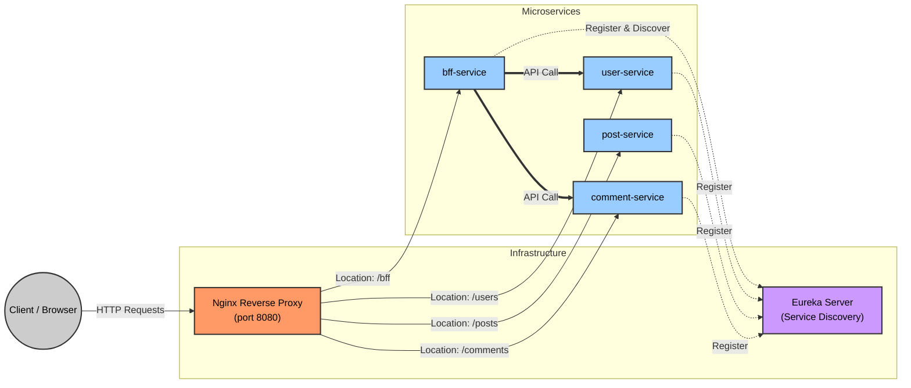
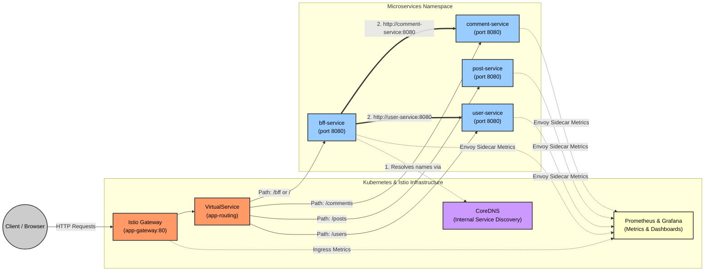

# 9 - First Istio architecture
In this lesson, you will learn how to use Istio instead of Eureka and Nginx in the `service-routing` example.
Indeed, Kubernetes CoreDNS can seamlessly replace Eureka for service discovery, while the Istio Gateway can replace the 
Nginx reverse proxy. In addition, Istio provides secure communication between pods (**mTLS**) and powerful observability 
out of the box.  

**service-routing system**


# Migrating to Kubernetes & Istio
To adapt the existing system to fit an Istio-enabled Kubernetes cluster, we need to perform the following actions:
1. **Remove Nginx Reverse Proxy**: Remove the `nginx` module from your parent build files.
2. **Remove Eureka Service Discovery Server**: Delete the `eureka-service` module completely.
3. **Remove Eureka Dependencies from the microservices**
   1. Remove the `Eureka` and `Spring Cloud` dependencies from `pom.xml`.
   2. Remove Eureka-related configurations from `application.yml`.
   3. Remove any `@LoadBalanced` annotations in the Java codebase (**Kubernetes and Istio will now handle load balancing natively**)
   4. Modify your routing URIs to match the new environment. Thanks to CoreDNS, each microservice can be directly 
      reached at `http://<microservice-name>:<port>`.
4. **Compile the Applications**: Build your Java services using `mvn clean package -Dmaven.test.skip=true`.
5. **Containerize**: Build the Docker images and push them to your container registry.

# Define the infrastructure
Now that the container images are ready, we will define the Kubernetes YAML manifests. Each microservice is deployed 
using a `Deployment` and exposed internally via a `Service`.
Here is an example for the `bff-service`:
```yaml
apiVersion: v1
kind: Service
metadata:
  name: bff-service
  labels:
    app: bff-service
spec:
  ports:
    - port: 8080
      targetPort: 8080
      name: http
  selector:
    app: bff-service
---
apiVersion: apps/v1
kind: Deployment
metadata:
  name: bff-service
spec:
  replicas: 1
  selector:
    matchLabels:
      app: bff-service
  template:
    metadata:
      labels:
        app: bff-service
    spec:
      containers:
        - name: bff-service
          image: mattev02/bff-service:latest
          ports:
            - containerPort: 8080
          env:
            - name: SERVER_PORT
              value: "8080"
          readinessProbe:
            httpGet:
              path: /actuator/health
              port: 8080
            initialDelaySeconds: 10
            periodSeconds: 10
          livenessProbe:
            httpGet:
              path: /actuator/health
              port: 8080
            initialDelaySeconds: 20
            periodSeconds: 10
```

To route external traffic into the cluster, we use Istio Gateway API. A `Gateway` handles the entry point (replacing 
standard Ingress objects), and an `VirtualService` directs the traffic to the corresponding microservices based on the 
requested path.

```yaml
apiVersion: networking.istio.io/v1
kind: Gateway
metadata:
   name: app-gateway
spec:
   selector:
      istio: ingressgateway
   servers:
      - port:
           number: 80
           name: http
           protocol: HTTP
        hosts:
           - "*"
---
apiVersion: networking.istio.io/v1
kind: VirtualService
metadata:
   name: app-routing
spec:
   hosts:
      - "*"
   gateways:
      - app-gateway
   http:
      # 1. The BFF Route
      - match:
           - uri:
                prefix: /bff
        route:
           - destination:
                host: bff-service
                port:
                   number: 8080

      # 2. The Users Route
      - match:
           - uri:
                prefix: /users
        route:
           - destination:
                host: user-service
                port:
                   number: 8080

      # 3. The Posts Route
      - match:
           - uri:
                prefix: /posts
        route:
           - destination:
                host: post-service
                port:
                   number: 8080

      # 4. The Comments Route
      - match:
           - uri:
                prefix: /comments
        route:
           - destination:
                host: comment-service
                port:
                   number: 8080

      # 5. Default catch-all route fallback
      - route:
           - destination:
                host: bff-service
                port:
                   number: 8080
```

# The new architecture
The final system architecture is represented below.  
You can test the architecture on your own machine by following this guide: [service-mesh README](../labs/service-mesh/README.md)


> ❓ **What are the advantages of this system compared to the initial one?**
> - **Reduced codebase**: Removes boilerplate code and eliminates the need for maintaining a standalone Eureka server.
> - **Language Agnosticism**: While Eureka ties you heavily to the Java ecosystem, Istio works natively with applications written in any language.
> - **Offloading Resilience to Infrastructure**: In a traditional Spring Boot app, you must configure libraries like Resilience4j and write fallback logic in Java. Istio manages retries, timeouts, and circuit breaking at the platform level.
> - **Simplified Observability**: Metrics, tracing, and logging are captured automatically by the Envoy sidecars.
> - **Encrypted Communications**: Istio transparently enforces mTLS between pods, securing internal traffic.
> - **Zero-Trust Security**: Istio allows you to define strict `AuthorizationPolicies`. For example, you can write a rule stating: "Only bff-service is allowed to call user-service. Reject traffic from any other pod."


