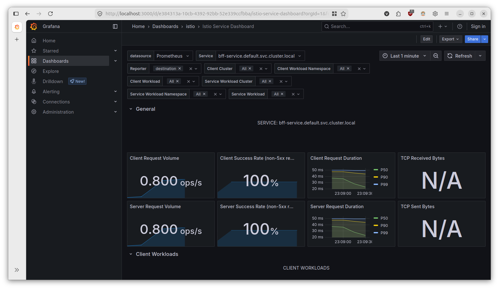
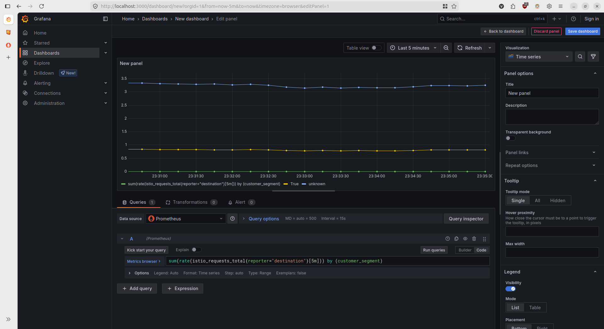
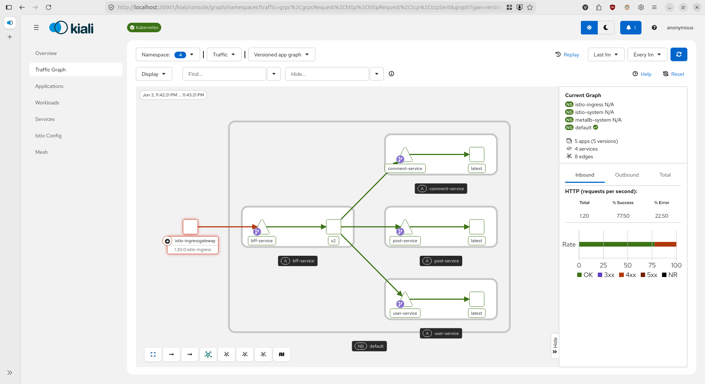

# 10 - Istio observability

In a microservices architecture, tracking requests as they traverse multiple network boundaries is notoriously difficult. 
Istio solves this by injecting Envoy sidecar proxies next to your workloads. These proxies intercept all inbound and 
outbound traffic, allowing Istio to automatically generate rich telemetry-metrics, logs, and distributed traces-without 
requiring you to change your application code.  Two of the most critical tools in the Istio ecosystem for visualizing 
this telemetry are **Grafana** (for _performance metrics_) and **Kiali** (for _usage metrics_ and _topology_).  

## 1. Grafana

Grafana is an open-source analytics and interactive visualization web application. In the context of Istio, it is used 
to query and visualize the time-series metrics collected by Prometheus from the Envoy proxies.

> 🗒️ **Installation**  
> Follow the guide at [8 - Istio # Run Grafana](8%20-%20Istio.md#run-the-grafana-dashboard-on-the-cluster).

### What kind of metrics you can find
Istio exports standard metrics out-of-the-box that map directly to the Four Golden Signals of monitoring:
- **Traffic** (Volume): Measures the total number of requests (istio_requests_total).
- **Latency**: Measures the duration of requests (istio_request_duration_milliseconds).
- **Errors**: Tracks failed requests, usually segmented by HTTP status codes (e.g., 4xx and 5xx errors).
- **Saturation**: Tracks how "full" the service is (e.g., TCP connections, proxy CPU/memory usage).

When you install Grafana with Istio, you get several pre-configured dashboards:
- **Mesh Dashboard**: A high-level overview of the entire service mesh, showing global success rates and request volumes.
- **Service Dashboard**: Drills down into individual services (e.g., evaluating the performance of the checkout service).
- **Workload Dashboard**: Focuses on the underlying deployments or pods backing a service.

### Add custom metrics
While standard metrics are powerful, you often need business-specific or infrastructure-specific dimensions (like 
tracking requests by a specific customer segment or custom HTTP header). Istio allows you to add custom metrics using 
the `Telemetry API`.  You configure this by creating a Telemetry Custom Resource Definition (CRD). The following example 
demonstrates how to extract a custom header (`x-beta-version`) and append it as a new dimension to your metrics:
```yaml
apiVersion: telemetry.istio.io/v1alpha1
kind: Telemetry
metadata:
  name: custom-metrics
  namespace: istio-system
spec:
  metrics:
    - providers:
        - name: prometheus
      overrides:
        - match:
            metric: REQUEST_COUNT
          tagOverrides:
            beta_users:
              value: "request.headers['x-beta-version']"
```
Then add the following PromQL query to the dashboard:
```
sum(rate(istio_requests_total{reporter="destination"}[5m])) by (customer_segment)
```


## 2. Kiali

While Grafana excels at rendering time-series data as graphs and gauges, Kiali struggles to answer questions like: _"Which 
services are talking to each other?"_ or _"Where is the traffic bottleneck in this specific transaction?"_. Kiali is a 
management console specifically built for Istio to visualize service mesh topology and configuration health.

> 🗒️ **Installation**  
> Run the following commands from the root of your downloaded Istio directory:
> ```shell
> kubectl apply -f samples/addons/prometheus.yaml
> kubectl apply -f samples/addons/kiali.yaml
> ```
> Once installed access the UI by port-forwarding.
> ```shell
> istioctl dashboard kiali
> ```

### What you can find
Kiali infers the structure of your microservices by analyzing the traffic flowing through them. It provides:
- **Topology Mapping (Service Graphs)**: Kiali auto-generates visual graphs of your architecture (App, Versioned App, Workload, and Service views). If a service starts failing, the corresponding node and its incoming edges turn red, allowing for immediate root-cause isolation.  
- **Traffic Distribution & Shifting**: If you are running multiple versions of a service (e.g., v1 and v2), Kiali visually displays the exact percentage of traffic going to each. It even provides a wizard to implement traffic splitting directly from the UI.
- **Configuration Validation**: Kiali scans your Istio configuration objects (VirtualServices, DestinationRules, Gateways) and flags misconfigurations or orphaned routes before they cause an outage.
- **Security Visualization**: It visually indicates which edges are secured with mTLS (Mutual TLS) by displaying padlock icons on the connection lines.

> ❓ **Why it is useful**  
> Modern microservice environments are too complex to map manually. Kiali bridges the gap between infrastructure 
> configuration and real-time observability, turning raw Prometheus metrics into an actionable, live map of your distributed system.