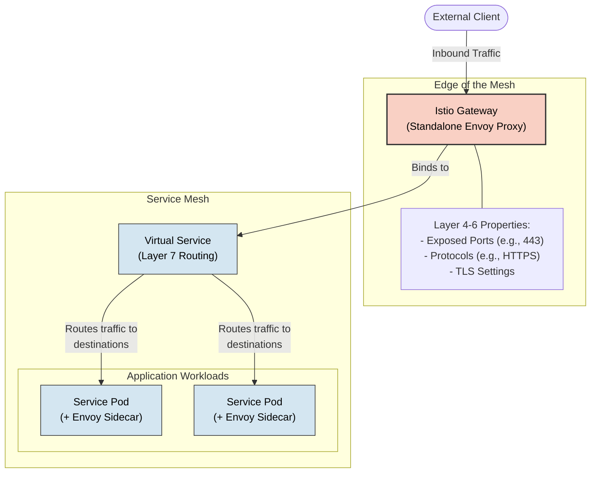
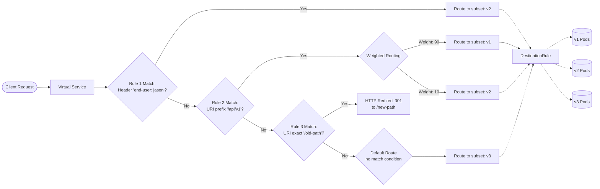

# 11 - Istio traffic management

**Istio**’s traffic management relies on Envoy proxies deployed as sidecars alongside your services. These proxies intercept 
and mediate all inbound and outbound data plane traffic, allowing you to orchestrate the flow of traffic around your 
service mesh without having to make any changes to your application code.

Below is an overview of the core API resources and concepts used to configure Istio traffic management.

> ⚠️ **Warning**  
> Istio is transitioning to the **Kubernetes Gateway API** as its default standard. While this course focuses on the 
> "legacy" Istio networking APIs for historical context and more mature functionalities, the Kubernetes Gateway API is 
> now the recommended approach for new deployments. Istio plans to eventually deprecate its custom resources in favor of 
> these unified Kubernetes standards.

## 1. Gateway
A `Gateway` is used to manage inbound and outbound traffic for your mesh. Unlike other Envoy proxies that run as sidecars 
next to your application workloads, gateway configurations are applied to standalone Envoy proxies operating at the edge 
of the mesh.

Gateways allow you to specify exact parameters for traffic entering or leaving the mesh, configuring Layer 4-6 load 
balancing properties such as exposed ports, protocols, and TLS settings.

### YAML Declaration
Instead of adding application-layer traffic routing (`Layer 7`) directly to the gateway, Istio lets you bind a regular 
Virtual Service to the gateway. Here is an example of an ingress gateway configured to accept external HTTPS traffic:

```yaml
apiVersion: networking.istio.io/v1
kind: Gateway
metadata:
  name: ext-host-gwy
spec:
  selector:
    app: my-gateway-controller
  servers:
  - port:
      number: 443
      name: https
      protocol: HTTPS
    hosts:
    - ext-host.example.com
    tls:
      mode: SIMPLE
      credentialName: ext-host-cert
```



## 2. Virtual Services
**Virtual services** and destination rules are the primary building blocks of Istio's traffic routing functionality. A 
`VirtualService` strongly decouples the user-facing destination that clients send requests to from the actual backend 
workloads that implement the service.

### YAML Declaration
The following virtual service routes traffic to different versions of a reviews service depending on whether the request 
comes from a specific user:

```yaml
apiVersion: networking.istio.io/v1
kind: VirtualService
metadata:
  name: reviews
spec:
  hosts:
  - reviews
  http:
  - match:
    - headers:
        end-user:
          exact: jason
    route:
    - destination:
        host: reviews
        subset: v2
  - route:
    - destination:
        host: reviews
        subset: v3
```

### Hosts
The `hosts` field lists the user-addressable destinations the routing rules apply to. These are the addresses clients use 
when sending requests. The host can be an IP address, a DNS name, a wildcard prefix, or a short name (like a Kubernetes 
service name). They do not actually need to exist in the Istio service registry, allowing you to model abstract virtual 
destinations.

### Routing Rules
The http section contains the routing rules that dictate how traffic is evaluated and forwarded:
- **Match Condition**: Evaluates whether a request matches the rule. In the example above, the match field looks for an exact 
  end-user HTTP header value. Conditions can be based on URIs, headers, ports, and more. There are 5 type of matches:
  - **URI matches**: You can route traffic based on the request path. This can be an **exact** match, a **prefix** match (e.g., 
    anything starting with `/api/v1`), or a **regex** (regular expression) match for complex patterns.
  - **Header Matches**: You can inspect HTTP headers to make routing decisions. You can match exact values (like
    `end-user: john`), check for a prefix, use regex, or simply check if a specific header exists at all.
  - **Method Matches**: Traffic can be routed based on the HTTP verb being used, allowing you to treat GET requests 
    differently than POST or DELETE requests.
  - **Query Parameters**: Routing can be based on the key-value pairs in the URL query string.
  - **Port Matches**: If your service exposes multiple ports, you can specify rules that only apply to traffic entering on a specific port.

```yaml
http:
  - match:
      # URI Match: Prefix match for any path starting with /api/v1
      - uri:
          prefix: /api/v1
      # Header Match: Exact match checking if the 'end-user' header is 'john'
      - headers:
          end-user:
            exact: john
      # Method Match: Applies only to HTTP GET requests
      - method:
          exact: GET
      # Query Parameter Match: Checks for '?tier=premium' in the URL
      - queryParams:
          tier:
            exact: premium
      # Port Match: Only applies if traffic is entering via port 8080
      - port: 8080
    # (Route destination would follow here...)
```
- **Destination**: If a condition is met, the traffic is sent to the specified destination. Unlike the virtual host, this 
  must be a real destination in Istio's service registry.
  - **Host and Subset**: The host must be a fully qualified domain name (**FQDN**) or a recognized Kubernetes service name. The subset maps back to the groupings defined in your `DestinationRule`.
  - **Weighted Routing**: You can assign a `weight` (an integer percentage) to multiple destinations within a single rule. For example, you can route 90% of traffic to your `v1` subset and 10% to your `v2` subset. This is the foundation of canary deployments in Istio.

```yaml
http:
  - route:
      - destination:
          host: reviews.default.svc.cluster.local
          subset: v1
        # 90% of traffic goes to v1
        weight: 90
      - destination:
          host: reviews.default.svc.cluster.local
          subset: v2
        # 10% of traffic goes to v2
        weight: 10
```
- **Traffic manipulation**: Routing rules are not limited to just forwarding traffic. They can also manipulate the request transparently before it reaches the destination.
  - **HTTP Redirects**: You can instruct the Envoy proxy to return an HTTP redirect (like a 301 or 302 status code) to the client, pointing them to a completely different URI or `authority/host`.

```yaml
http:
  - match:
      - uri:
          exact: /old-path
    # The proxy returns a redirect to the client; no 'route' destination is needed here
    redirect:
      uri: /new-path
      authority: new-service.com
      redirectCode: 301
```
- 
  - **HTTP Rewrites**: Unlike a redirect, a rewrite happens transparently. The Envoy proxy modifies the URI path or the Authority/Host header of the request before sending it to the backend service. The client remains completely unaware that the internal path changed.

```yaml
http:
  - match:
      - uri:
          prefix: /external-api/
    # Modifies the request to the backend
    rewrite:
      uri: /internal-api/v2/
      authority: internal-backend.local
    route:
      - destination:
          host: backend-service
```
- 
  - **Header Manipulation**: You can append, modify, or remove HTTP headers from a request before it is forwarded, or from a response before it is returned to the client.

```yaml
http:
  - route:
      - destination:
          host: my-service
    # Manipulating headers for this specific route
    headers:
      request:
        set:
          x-injected-by: "istio-envoy"
        remove:
          - x-deprecated-client-id
      response:
        add:
          x-processed-time: "true"
```
- **Precedence and Execution Logic**: Because routing can get complex, understanding how Envoy evaluates these rules is critical.
  - **Top-to-Bottom Evaluation**: Istio evaluates routing rules sequentially, starting from the very top of the YAML file.
  - **First Match Wins**: The proxy applies the routing logic of the first rule that matches the request. It does not look for the "best" or "most specific" match; it simply looks for the first one.
  - **Order Matters**: You must place your most specific rules (e.g., exact header or URI matches) at the top of your VirtualService.
  - **The Catch-All Default**: The final rule in your HTTP block should almost always omit the match field entirely. This ensures that any traffic failing to trigger your specific rules still has a default destination and isn't dropped.

**Example**  

```yaml
apiVersion: networking.istio.io/v1
kind: VirtualService
metadata:
  name: dynamic-routing-service
spec:
  hosts:
    - my-app.default.svc.cluster.local # The destination host clients are trying to reach
  http:
    # --- RULE 1: Most Specific Match (Header) ---
    # Evaluated first. If the user is 'jason', send to v2.
    - match:
        - headers:
            end-user:
              exact: jason
      route:
        - destination:
            host: my-app.default.svc.cluster.local
            subset: v2

    # --- RULE 2: URI Match with Traffic Splitting (Canary) ---
    # Evaluated second. If the path starts with /api/v1, split 90/10.
    - match:
        - uri:
            prefix: /api/v1
      route:
        - destination:
            host: my-app.default.svc.cluster.local
            subset: v1
          weight: 90
        - destination:
            host: my-app.default.svc.cluster.local
            subset: v2
          weight: 10

    # --- RULE 3: Traffic Manipulation (HTTP Redirect) ---
    # Evaluated third. If exactly hitting /old-path, bounce them to /new-path.
    - match:
        - uri:
            exact: /old-path
      redirect:
        uri: /new-path
        redirectCode: 301 # 301 Moved Permanently

    # --- DEFAULT RULE: Catch-All ---
    # Evaluated last. If none of the above conditions were met, route to v3.
    # Note the complete absence of a 'match' block here.
    - route:
        - destination:
            host: my-app.default.svc.cluster.local
            subset: v3
```



## 3. Destination Rule
If Virtual Services determine where traffic is routed, **Destination Rules** configure what happens to the traffic once it 
reaches that destination. They are applied after virtual service routing rules are evaluated.

### YAML Declaration
Here is an example of a Destination Rule configuring subsets and assigning different load balancing options:

```yaml
apiVersion: networking.istio.io/v1
kind: DestinationRule
metadata:
  name: my-destination-rule
spec:
  host: my-svc
  trafficPolicy:
    loadBalancer:
      simple: RANDOM
  subsets:
  - name: v1
    labels:
      version: v1
  - name: v2
    labels:
      version: v2
    trafficPolicy:
      loadBalancer:
        simple: ROUND_ROBIN
  - name: v3
    labels:
      version: v3
```

### Subsets
Subsets define specific groupings of your service's instances, frequently used for A/B testing or canary deployments. 
Each subset is mapped to a Kubernetes deployment using labels (key/value metadata pairs attached to your Pods). Once your 
subsets are defined in a Destination Rule, your Virtual Services can safely route traffic to them.

### Load Balancing Options
By default, Envoy proxies distribute traffic using a least requests model (routing to the host with the fewest active 
requests). Destination Rules allow you to override this with other algorithms, either globally for the service or on a 
per-subset basis:
- **Random**: Forwards requests entirely at random.
- **Weighted**: Directs a specific percentage of traffic to instances.
- **Round Robin**: Forwards requests to each instance in strict sequence.  
- **Consistent Hash**: Provides soft session affinity based on HTTP headers, cookies, or source IP using algorithms like Ring Hash or Maglev.

## Appendix: Network Resilience and Testing
Istio provides out-of-the-box mechanisms to build network resilience and test failure recovery transparently, completely 
independent of your application logic.

### Timeouts
A timeout dictates the maximum amount of time an Envoy proxy should wait for a reply from a given service. Configuring 
timeouts ensures calls succeed or fail within a predictable window rather than hanging indefinitely. You can configure 
timeouts dynamically on a per-service basis via a Virtual Service:

```yaml
apiVersion: networking.istio.io/v1
kind: VirtualService
metadata:
  name: ratings
spec:
  hosts:
    - ratings
  http:
    - route:
        - destination:
            host: ratings
            subset: v1
      timeout: 10s
```

### Retries
Retries improve service availability by specifying the maximum number of times an Envoy proxy should attempt to connect 
to a service if the initial call fails. Istio handles the interval between retries automatically to ensure the failing 
service isn’t overwhelmed by traffic.

```yaml
apiVersion: networking.istio.io/v1
kind: VirtualService
metadata:
  name: ratings
spec:
  hosts:
  - ratings
  http:
  - route:
    - destination:
        host: ratings
        subset: v1
    retries:
      attempts: 3
      perTryTimeout: 2s
```

### Circuit Breakers
Circuit breaking is a technique to prevent localized transient failures from cascading to other nodes in the mesh. 
Circuit breakers are configured in DestinationRule resources. You can limit the impact of failures by restricting the 
number of concurrent connections or requests allowed to a service:

```yaml
apiVersion: networking.istio.io/v1
kind: DestinationRule
metadata:
  name: reviews
spec:
  host: reviews
  subsets:
    - name: v1
      labels:
        version: v1
      trafficPolicy:
        connectionPool:
          tcp:
            maxConnections: 100
```

### Fault Injection
To test your application's failure recovery policies, Istio allows you to deliberately inject faults at the application
layer. This helps identify restrictive or incompatible recovery configurations before they cause an outage. (Note: Fault
injection currently cannot be combined with retries or timeouts on the same Virtual Service).

You can inject two types of faults using a Virtual Service:
- **Delays**: Timing failures that mimic increased network latency or overloaded upstream services.
- **Aborts**: Crash failures that mimic upstream service failures by returning HTTP error codes.

Example of injecting a 5-second delay for 30% of requests:

```yaml
apiVersion: networking.istio.io/v1
kind: VirtualService
metadata:
  name: ratings
spec:
  hosts:
  - ratings
  http:
  - fault:
      delay:
        percentage:
          value: 30.0
        fixedDelay: 5s
    route:
    - destination:
        host: ratings
        subset: v1
```

Example of injecting a 404 error for 30% of requests:

```yaml
apiVersion: networking.istio.io/v1
kind: VirtualService
metadata:
  name: ratings
spec:
  hosts:
  - ratings
  http:
  - fault:
      abort:
        errorCode: 404
        percentage: 30.0
    route:
    - destination:
        host: ratings
        subset: v1
```