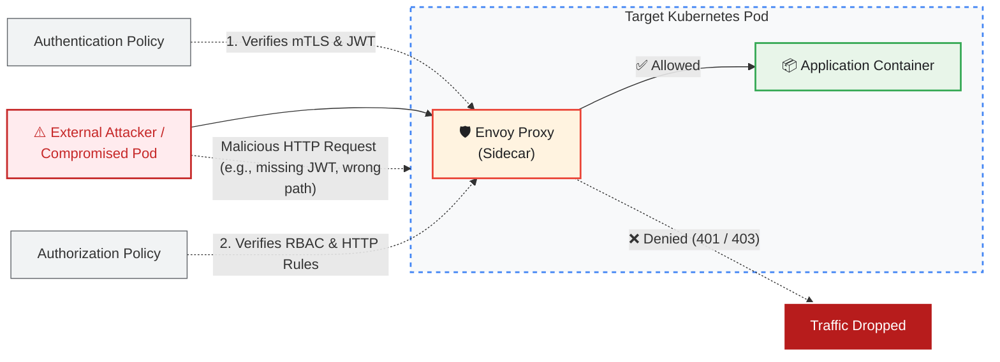

# 12 - Istio security

Istio provides the following security features:
- **Mutual pods authentication** via Mutual TLS: [see reference](https://istio.io/latest/docs/tasks/security/authentication/authn-policy)
- **End-user authentication**: configurable JSON Web Token verification per path [see reference](https://istio.io/latest/docs/tasks/security/authentication/authn-policy/#end-user-authentication)
- **Filter HTTP traffic**: allow only traffic with some characteristics between pods [see reference](https://istio.io/latest/docs/tasks/security/authorization/authz-http/)
- **Authorization**: give different kubernetes accounts different permissions [see reference](https://istio.io/latest/docs/concepts/security/#authorization)

