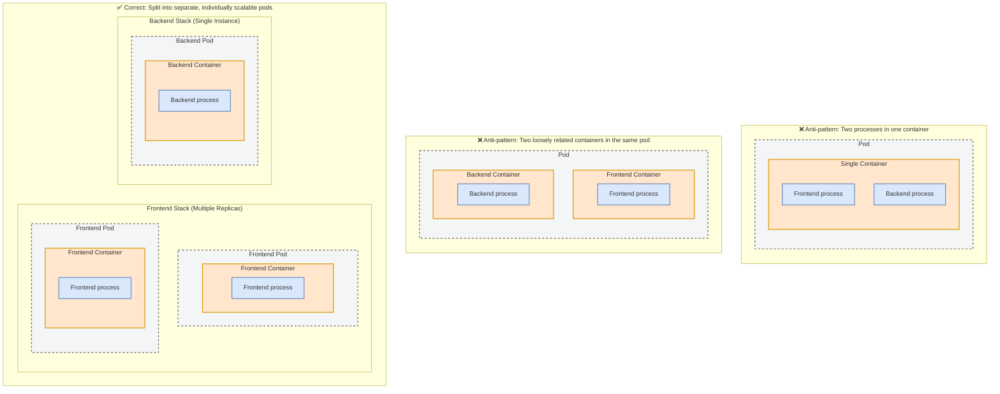
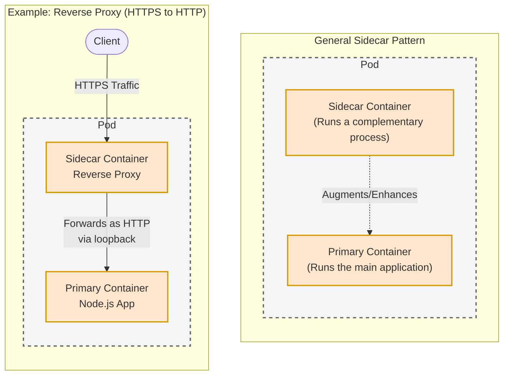
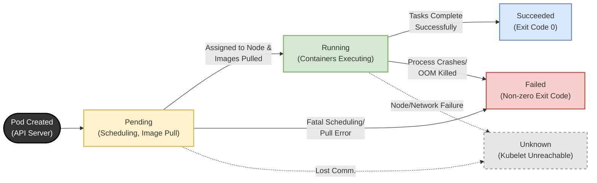
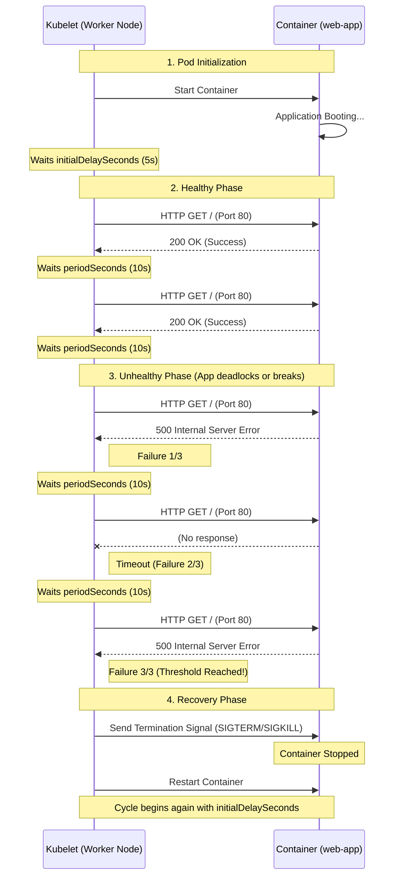

# 3 - Pod

## Pod overview
A pod is a co-located group of containers and serves as the basic building block in Kubernetes. Instead of deploying containers individually, you deploy and manage this group of containers as a single, manageable unit. It represents a running instance of your application.  
  
While containers are generally isolated, the processes running in a pod's containers share certain Linux namespaces to function together seamlessly. All containers in a pod share the **same Network namespace**, meaning they **share the same network interfaces, IP addresses, and port space** (eliminating port conflicts between different pods while allowing containers in the same pod to communicate via localhost). They also share the **UTS namespace** (seeing the same system hostname) and the **IPC namespace** (allowing standard inter-process communication).  

**Isolated Mount Namespaces and Volumes**: It is important to note that containers in a pod do not share the mount namespace by default. Each container has its own isolated file system provided by its container image. If containers within the same pod need to share files, you must explicitly define a Kubernetes Volume and mount it into the required containers.

A fundamental architectural rule in Kubernetes is that a single pod instance never spans multiple nodes.  
Because they share local resources, networking, and namespaces, all containers defined within a specific pod are strictly co-located and execute on the exact same physical or virtual worker node.  
When you create a pod object, `kube-scheduler` (a scheduler managed by the Kubernetes control plane) schedules it to an appropriate worker node based on resource availability and requirements. Once scheduled, the Kubelet service on that specific node takes over to pull the required images and start the containers.

## 1. Exploring Pods with `kubectl explain pod`

Before deploying objects, it is essential to understand their structure.  
- You can explore the fields of a pod manifest and find out what additional fields can be added by using the kubectl explain pods command.
- This command acts as a built-in documentation tool, providing details about the API object's specifications and expected configurations.

```shell
kubectl explain pod
kubectl explain pod.spec
...
```

## 2. Structuring Pods for replication and Sidecar Pattern
Pods are the basic building blocks in Kubernetes, consisting of a co-located group of containers.
- **Single Process per Container**: Containers are specifically designed to run only a single process. If you run multiple processes in one container, they all write to the same output, making logs intertwined and difficult to manage. Additionally, the container runtime only restarts a container when its root process dies, ignoring child processes.
- **Replication and Scaling**: A pod is the basic unit of both deployment and horizontal scaling. Kubernetes replicates the entire pod, not individual containers within it.  
Therefore, components with different scaling requirements (e.g., a stateless frontend and a stateful backend) should be split into separate pods.

- **Sidecar Containers**: You should place multiple containers in a single pod only if they form a unified whole and share resources.  
  A "**sidecar container**" runs a complementary process to augment the primary application container. Examples include adding a reverse proxy for HTTPS support without modifying the main application's code, or an agent that delivers content to a web server.


## 3. Debugging pods
During development or debugging, you may need to bypass load balancers and communicate directly with a specific pod.
- The `kubectl port-forward` command allows you to communicate with a pod through a proxy bound to a network port on your local computer.
- For example, executing `kubectl port-forward product-service 8080` forwards your local port 8080 to the pod's port 8080.
- The communication path routes from your local proxy to the Kubernetes API server, then to the Kubelet on the hosting node, and finally to the container through the pod's loopback device.

Moreover, containers typically log to the standard output and standard error streams. To display them you can simply run:
```shell
kubectl logs POD_NAME
```

Another Kubernetes useful debugging feature comes with the ability of copying files from pods to local computer and vice versa.
```shell
# Copy from pod
kubectl cp POD_NAME:html/index.html /tmp/index.html
# Copy to pod
kubectl cp /tmp/index.html POD_NAME:html/
```

In a similar way to Docker CLI, it is possible to execute commands and attach to a remote pod:
```shell
# execute a command
kubectl exec POD_NAME -- COMMAND

# execute a command interactively (eg. bash)
kubectl exec -it POD_NAME -- bash

# attach to a pod
kubectl attach POD_NAME
```

## 4. Init Containers
Init containers are special containers intended strictly to initialize a pod before the regular containers start.
- **Execution Flow**: They execute sequentially. Each init container must finish successfully before the next one starts, and all must complete before the pod's main containers launch in parallel.
- **Use Cases**: They are used to initialize files in shared volumes, configure the pod's network system, or delay main container startup until a specific precondition (like an external database becoming available) is met.  
- **Security**: By placing initialization logic requiring secret tokens or elevated privileges inside an init container, you shrink the attack surface of the main container.

```mermaid
flowchart LR
    %% Define CSS classes for visual hierarchy
    classDef pod fill:#f4f5f7,stroke:#666,stroke-width:2px,stroke-dasharray: 5 5;
    classDef init fill:#fff2cc,stroke:#d6b656,stroke-width:2px;
    classDef main fill:#dae8fc,stroke:#6c8ebf,stroke-width:2px;
    classDef condition fill:#f8cecc,stroke:#b85450,stroke-width:2px;

    Start(["Pod Scheduled & Started"]) --> Init1
    
    subgraph Pod ["Pod Lifecycle Stages"]
        direction LR
        
        %% --- INITIALIZATION STAGE ---
        subgraph InitStage ["Initialization Stage (Runs Sequentially)"]
            direction LR
            Init1["1st Init Container\n(e.g., Generate config)"]:::init
            Fail1{"Fails?"}:::condition
            
            Init2["2nd Init Container\n(e.g., Network check)"]:::init
            Fail2{"Fails?"}:::condition
            
            Init1 --> Fail1
            Fail1 -- "Yes (Restarts)" --> Init1
            Fail1 -- "No (Success)" --> Init2
            
            Init2 --> Fail2
            Fail2 -- "Yes (Restarts)" --> Init2
        end
        
        %% --- RUN STAGE ---
        subgraph RunStage ["Run Stage (Runs in Parallel)"]
            direction TB
            Main1["Regular Container A\n(e.g., Node.js App)"]:::main
            Main2["Regular Container B\n(e.g., Envoy Proxy Sidecar)"]:::main
        end
        
        Fail2 -- "No (Success)\nAll Init Containers Finished" --> RunStage
    end
```


Here is an example of a Pod YAML configuration with an init container specified:
```yaml
apiVersion: v1
kind: Pod
metadata:
  name: minimal-init-demo
spec:
  initContainers:
  - name: init-task
    image: busybox:1.28
    command: ['ping','-c 1', '1.1.1.1']
  
  containers:
  - name: main-app
    image: nginx:alpine
    ports:
    - containerPort: 80
```

## 5. Pod phases
A pod goes through a distinct lifecycle, tracked by its phase.
- `Pending`: The initial phase where the pod is scheduled to a node and the container images are being pulled.
- `Running`: At least one of the pod's containers is actively running.
- `Succeeded`: All containers in the pod have terminated successfully (typically for finite tasks).
- `Failed`: At least one container terminated with a non-zero exit code.
- `Unknown`: The Kubelet has stopped communicating with the API server regarding the pod.


## 6. Pod conditions
While phases offer a high-level summary, pod conditions specify whether a pod has reached critical milestones.
- `PodScheduled`: Indicates if the pod has been successfully assigned to a node.
- `Initialized`: Confirms that all init containers have run to completion successfully.
- `ContainersReady`: Indicates that all individual containers in the pod report being ready.
- `Ready`: Confirms the pod is fully ready to provide services to clients.
- Conditions can switch between `True`, `False`, or `Unknown`, and often provide a reason and message detailing their current status.

## 7. Container Status
Inside the pod's status, Kubernetes tracks the exact state of each individual container.
- `Waiting`: The container is waiting to start; the status includes a reason explaining the delay.
- `Running`: Processes are actively executing inside the container.
- `Terminated`: The container's processes have stopped; the status will show the specific exit code.

## 8. Pod Restart Policy
Kubernetes ensures self-healing by restarting containers based on the pod's restartPolicy.
- `Always`: The default policy. The container is restarted regardless of whether it exited successfully or failed.
- `OnFailure`: The container is restarted only if it terminates with a non-zero exit code.
- `Never`: The container is never restarted.  
- `Exponential Back-off`: To prevent failing containers from constantly overloading the system, Kubernetes inserts an exponentially increasing delay before restarting a crashed container (10s, 20s, 40s, etc.), capped at 5 minutes.

Here is an example:
```yaml
apiVersion: v1
kind: Pod
metadata:
  name: restart-policy-demo
spec:
  # The restartPolicy is defined at the Pod spec level
  restartPolicy: OnFailure
  containers:
  - name: failing-container
    image: busybox:1.28
    # This command intentionally exits with an error code (1) after 5 seconds
    command: ['sh', '-c', 'sleep 5 && exit 1']
```

## 9. Liveness Probes
Applications can become unresponsive (e.g., deadlocks or infinite loops) without their processes actually terminating. Liveness probes allow Kubernetes to check the health of an application externally.
- **Mechanism**: If a liveness probe fails consecutively, the container is considered unhealthy, forcibly terminated, and restarted (subject to the restart policy).
- **Probe Types**:
  - **HTTP GET**: Considered successful if the server responds with a 2xx or 3xx HTTP status code.
  - **gRPC**: Considered successful if the application implements the gRPC health checking protocol and responds with a healthy status.
  - **TCP Socket**: Considered successful if a TCP connection can be established on a specified port.
  - **Exec**: Executes a command inside the container; successful if the command returns an exit code of zero.
- Configuration: Probes are customized using parameters like `initialDelaySeconds` (how long to wait before the first check), `periodSeconds` (interval between checks), `timeoutSeconds` (how long to wait for a response), and `failureThreshold` (number of consecutive failures required to trigger a restart).

In this example, we deploy a standard NGINX web server. We configure the liveness probe to send an HTTP GET request to the root path (/) on port 80.
```yaml
apiVersion: v1
kind: Pod
metadata:
  name: liveness-http-demo
spec:
  containers:
  - name: web-app
    image: nginx:alpine
    ports:
    - containerPort: 80
    
    # Define the liveness probe
    livenessProbe:
      httpGet:
        path: /
        port: 80
      # Timing and Threshold Configurations:
      initialDelaySeconds: 5  # Wait 5 seconds after container starts before first check
      periodSeconds: 10       # Perform the check every 10 seconds
      timeoutSeconds: 2       # Consider the check failed if no response within 2 seconds
      failureThreshold: 3     # Restart the container after 3 consecutive failures
```

This diagram illustrates the lifecycle of the liveness probe defined in the YAML above. It shows a scenario where the application starts healthy, eventually experiences a failure (like a deadlock), and is automatically restarted by Kubernetes.

