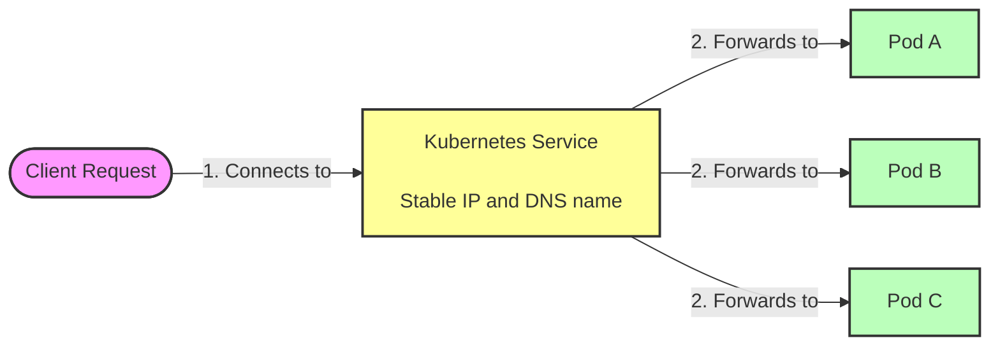
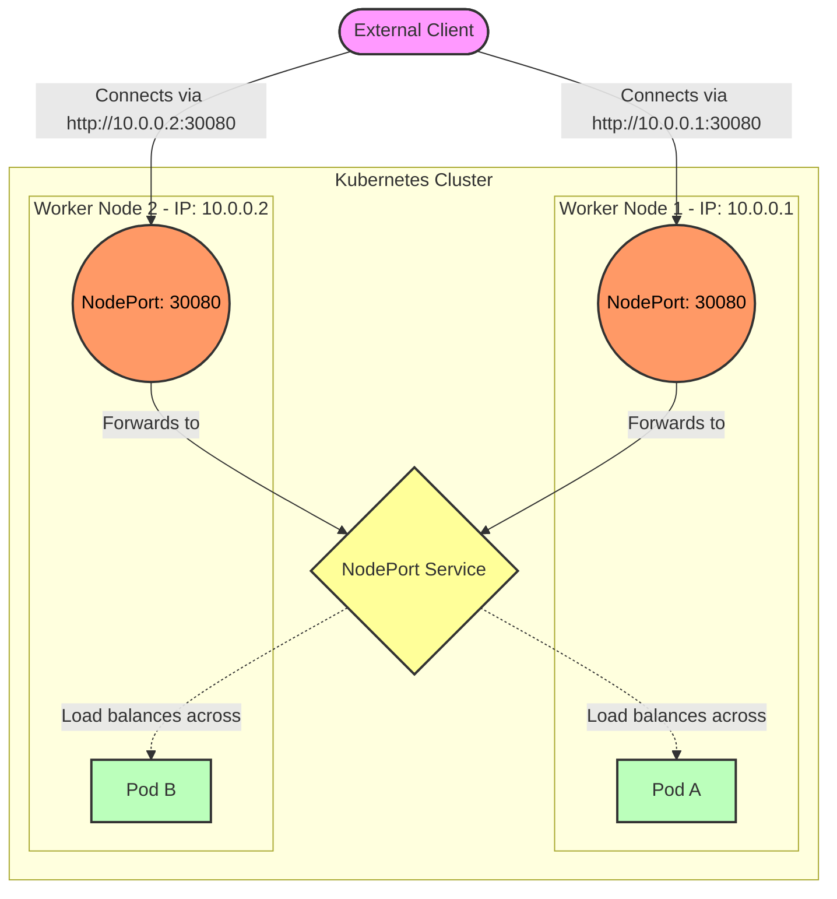
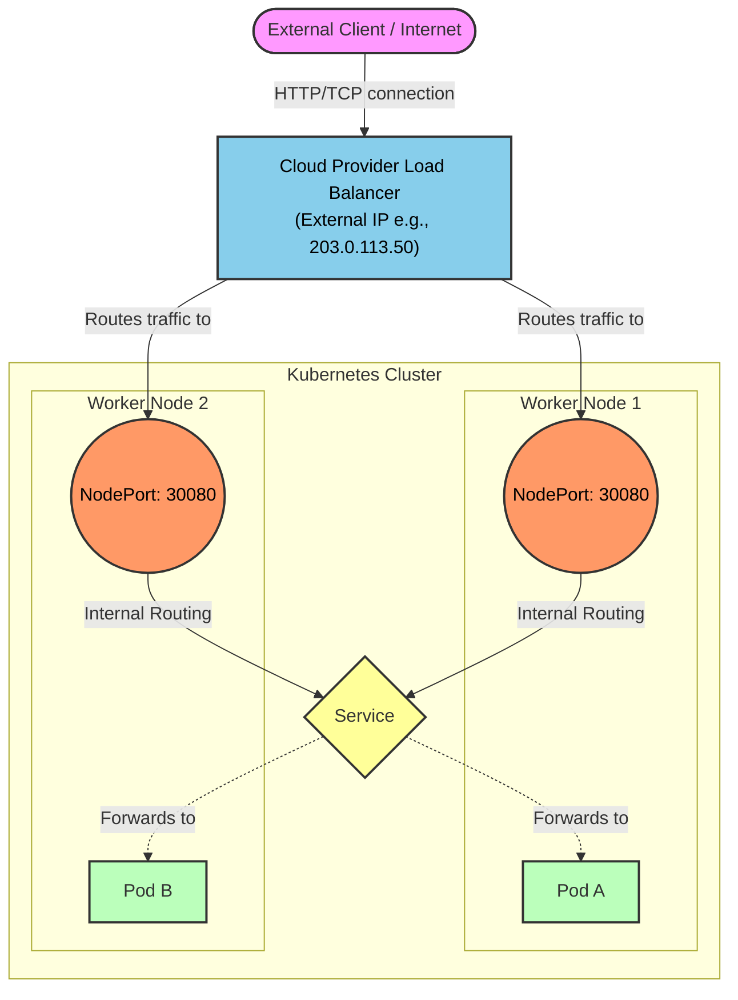
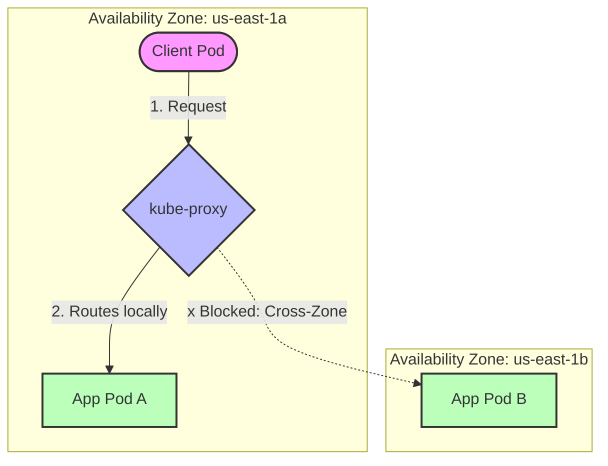

# 5 - Services
In Kubernetes, Pods are ephemeral. They are constantly created, destroyed, and scaled up or down, meaning their IP addresses 
change frequently. If an application in Pod A needs to communicate with an application in Pod B, tracking Pod B's IP address 
would be a nightmare.

A **Service** is a Kubernetes object that provides a single, stable access point (a constant IP address and port) to a set 
of pods providing the same functionality. It acts as an internal load balancer. While the pods behind the service may 
come and go, the service's IP address remains completely static for its entire lifecycle.



Here is how a Service YAML looks like:
```yaml
apiVersion: v1
kind: Service
metadata:
  name: service
spec:
  type: ClusterIP
  selector:
    app: service-pod
  ports:
  - name: http
    port: 80
    targetPort: 80
    protocol: TCP
```

## 1. Resolving Services via DNS
Kubernetes clusters run an internal DNS server (usually CoreDNS). This allows pods to communicate with services using 
human-readable domain names instead of memorizing cluster IPs.

Here is a practical example to prove how this works:
**Step 1: Create a basic pod and expose it**
```shell
kubectl run webserver --image=nginx --labels="app=webserver" --port=80
kubectl expose pod webserver --name=webserver-service --port=80
```

**Step 2: Run a temporary testing container**
```shell
kubectl run -it --rm dns-test --image=giantswarm/tiny-tools -- sh
```

**Step 3: Resolve and curl the service from inside the test container**
```shell
curl http://quiz-service
nslookup quiz-service
```

Because of the internal DNS, the test pod seamlessly translates http://quiz-service to the service's internal cluster IP.

## 2. Virtual IP of Service
A common misconception when debugging Kubernetes networking is attempting to ping a service.
If you are inside your testing pod and you run:
```shell
ping quiz-service
```
You will experience **100% packet loss**.
> ❓ **Why?**   
> The cluster IP assigned to a service is completely **virtual**. It has no meaning on its own and only exists in 
> conjunction with the specific port defined in the Service YAML. Because `ping` uses the ICMP protocol (not TCP/UDP) 
> and does not target the exposed port, the network ignores it. You cannot ping a Kubernetes service.

## 3. NodePort Service
A NodePort service makes your internal pods accessible to the outside world by opening a specific port (between 30000 
and 32767) on every single node in your cluster.
When a client connects to the IP address of any worker node on that specific port, the node forwards the traffic to the 
service, which then sends it to a backing pod.
> ❓ **When it is useful?**  
> NodePorts are great for local development, on-premises bare-metal setups, or when you want to set up your own custom 
> external load balancer to point to the nodes.



**Test**:
```shell
# Find the external/internal IPs of your cluster nodes
kubectl get nodes -o wide

# Access the service using any node's IP and the assigned NodePort
curl http://<NODE_IP>:30080
```

## 4. Expose a Service via LoadBalancer
A LoadBalancer service is an extension of a NodePort. When you create it, Kubernetes reaches out to your cloud provider 
(like AWS, GCP, or Azure) and automatically provisions a real, external cloud load balancer.
This load balancer receives public internet traffic and routes it to the NodePorts on your cluster nodes.
> ❓ **When it is useful?**  
> This is the standard way to expose TCP/UDP services to the public internet in production cloud environments.



While simply setting type: LoadBalancer is enough to provision an external IP, Kubernetes provides several fields in the 
Service spec to give you more granular control over how the load balancer behaves:

| Field                             | Type       | Description                                                                                                            |
|-----------------------------------|------------|------------------------------------------------------------------------------------------------------------------------|
| **loadBalancerClass**             | `string`   | Specifies which load balancer class to use if the cluster runs multiple controllers (depends on the cluster you have). |
| **loadBalancerIP**                | `string`   | Requests a specific static IP for the load balancer (depends on cloud provider support).                               |
| **loadBalancerSourceRanges**      | `[]string` | Restricts which client IP addresses are allowed to access the service.                                                 |
| **allocateLoadBalancerNodePorts** | `boolean`  | Controls whether to allocate node ports, as some implementations route directly to pods.                               |

```yaml
apiVersion: v1
kind: Service
metadata:
  name: kiada-advanced-lb
  namespace: kiada
  # Note: Cloud providers often require specific annotations in addition to the spec fields
  annotations:
    service.beta.kubernetes.io/aws-load-balancer-type: "external"
spec:
  type: LoadBalancer
  
  # 1. Choose a specific Load Balancer implementation (if multiple exist in the cluster)
  loadBalancerClass: "service.k8s.aws/nlb" 
  
  # 2. Request a specific static public IP (must be pre-allocated in your cloud provider)
  loadBalancerIP: "203.0.113.50"
  
  # 3. Restrict access: Only allow traffic from these specific IP addresses or subnets
  loadBalancerSourceRanges:
  - "198.51.100.0/24"  # Allow an entire office subnet
  - "203.0.113.15/32"  # Allow a single specific developer IP
  
  # 4. Prevent Kubernetes from opening a NodePort on every single worker node
  # (Useful if your cloud LB supports direct pod IP routing, improving security/efficiency)
  allocateLoadBalancerNodePorts: false 
  
  # Standard service routing
  selector:
    app: kiada
  ports:
  - name: http
    port: 80
    targetPort: 8080
```

## 5. Endpoints
While a Service defines how to access the pods, it does not actually hold the list of pod IP addresses. Kubernetes uses 
separate objects for this:
- **Endpoints Object**: Created automatically alongside the service. It actively tracks the IP addresses of all pods 
  matching the service's label selector.
- **EndpointSlice Object**: In huge clusters, a single Endpoints object tracking thousands of pods becomes a performance 
  bottleneck. EndpointSlices solve this by chunking endpoints into batches of 100. When a single pod changes state, 
  Kubernetes only has to update a small "slice" rather than broadcasting a massive list across the entire cluster.

## 6. Understanding DNS Record for Service Objects
Understanding DNS Records for Service Objects
Kubernetes automatically generates a few distinct DNS records for services:
- **A/AAAA Records**: Standard services resolve to their single internal ClusterIP.
- **SRV Records**: Created for the ports exposed by the service, allowing applications to discover port numbers 
  dynamically.

**Example**:
1. **Launch a DNS Testing pod**
```shell
kubectl run -it --rm dns-test --image=giantswarm/tiny-tools -- sh
```

2. **Inspecting A/AAAA Records**
```shell
nslookup SERVICE-NAME.NAMESPACE.svc.cluster.local
```

3. **Inspecting SRV Records**
While A records resolve to IP addresses, SRV (Service) records resolve to the specific ports exposed by the service. 
This is incredibly useful for dynamic service discovery, where an application needs to know both the IP and the port to 
connect to.  
The FQDN for a Kubernetes SRV record follows this strict pattern:  
`_<port-name>._<protocol>.<service-name>.<namespace>.svc.cluster.local`  
Let's assume our quote service exposes a TCP port named http.
```shell
nslookup -query=SRV kiada
nslookup -query=SRV _http._tcp.quote.kiada.svc.cluster.local
```

## 7. CNAME Alias and ExternalName Service
If you have an application running outside your cluster (like a managed database or a public API like worldtimeapi.org) 
and you want your internal pods to connect to it as if it were a local Kubernetes service, you use an ExternalName service.
```yaml
apiVersion: v1
kind: Service
metadata:
  name: time-api
spec:
  type: ExternalName
  externalName: worldtimeapi.org
```

This acts as a pure DNS alias. It does not create Endpoints or an IP address. It simply adds a CNAME record to the 
cluster DNS so that when pods request http://time-api, the DNS redirects them to worldtimeapi.org.

## 8. Topology-aware Service Traffic routing
In multi-region or multi-zone clusters, cross-zone network traffic introduces latency and costs money.
**Topology-aware routing** solves this. By enabling it, the Kubernetes control plane populates the EndpointSlice objects 
with "hints." These hints (e.g., `hints.forZones: zoneA`) tell the networking proxy on each node to preferentially route 
traffic to pods residing in the same availability zone. It keeps traffic local whenever possible, only failing over to 
other zones if local endpoints are exhausted.



**Enable the feature on your Service**:
```yaml
apiVersion: v1
kind: Service
metadata:
  name: quote-service
  annotations:
    # This annotation tells the Kubernetes control plane to calculate topology hints
    service.kubernetes.io/topology-aware-hints: "Auto" 
spec:
  selector:
    app: quote
  ports:
  - name: http
    port: 80
    targetPort: 80
```

Once you apply that Service, the Kubernetes control plane (specifically the EndpointSlice controller) automatically 
kicks in. It looks at the labels on your cluster nodes (like `topology.kubernetes.io/zone=us-east-1a`) to figure out where 
the pods are physically located.

It then injects hints directly into the auto-generated `EndpointSlice` object.

If you were to run `kubectl get endpointslice quote-service-xxxxx -o yaml`, you would see something like this:
```yaml
apiVersion: discovery.k8s.io/v1
kind: EndpointSlice
metadata:
  name: quote-service-5dqhx
endpoints:
- addresses:
  - 10.244.1.15
  conditions:
    ready: true
  nodeName: worker-node-1
  zone: us-east-1a
  hints:             # <-- HERE IS THE MAGIC
    forZones:
    - name: us-east-1a
```

## 9. Readiness probes
Just because a pod is running does not mean the application inside has finished booting, loaded its cache, or established 
database connections.
A Readiness Probe is an HTTP GET, TCP Socket, or Exec command configured in the Pod YAML that periodically checks if the 
app is actually ready to handle traffic.
How it connects to Services: If a pod's readiness probe fails, Kubernetes immediately updates the service's Endpoints 
and EndpointSlice objects. In the EndpointSlice, the `ready: true` condition for that specific pod is flipped to `ready: false`. 
The service stops routing traffic to that pod instantly, preventing users from experiencing errors, and resumes traffic 
only when the probe succeeds again.

**HTTP readiness probe**
```yaml
apiVersion: v1
kind: Pod
metadata:
  name: quiz-api
  labels:
    app: quiz
spec:
  containers:
  - name: quiz-api
    image: my-quiz-app:1.0
    ports:
    - containerPort: 8080
    
    # The Readiness Probe Definition
    readinessProbe:
      httpGet:
        path: /healthz/ready
        port: 8080
      initialDelaySeconds: 5    # Wait 5 seconds before checking the first time
      periodSeconds: 10         # Check again every 10 seconds
      failureThreshold: 3       # If it fails 3 times in a row, mark the pod as unready
      successThreshold: 1       # If it succeeds 1 time, mark the pod as ready again
      timeoutSeconds: 2         # The app has 2 seconds to respond before it counts as a failure
```